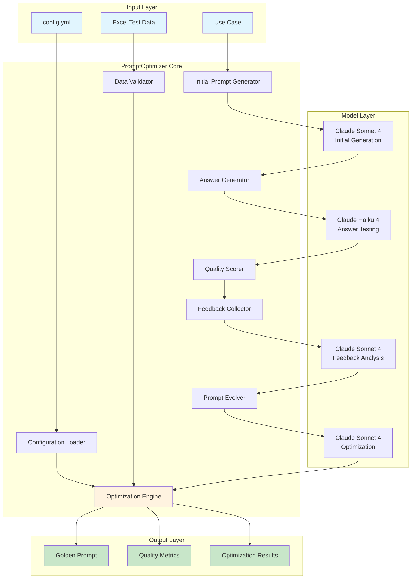
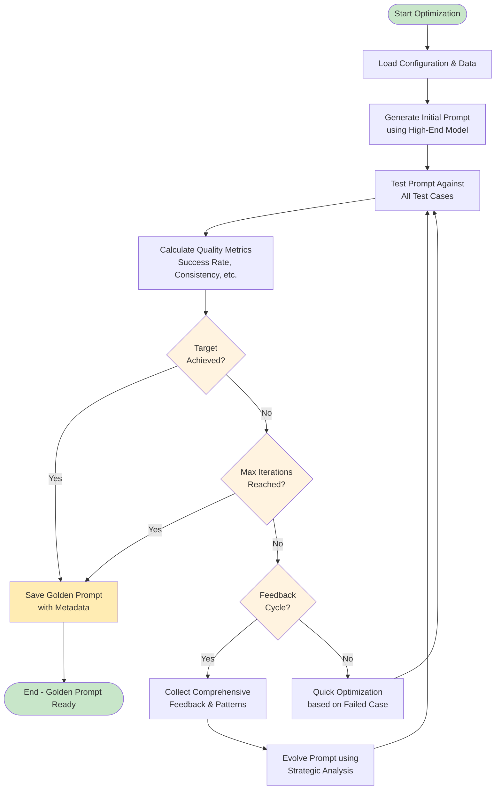
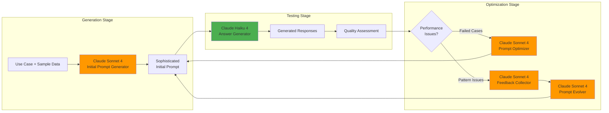

# PromptForge - Advanced Golden Prompt Generator

[](https://www.python.org/downloads/)
[](https://opensource.org/licenses/MIT)
[](https://claude.ai)

**PromptForge** is an intelligent prompt optimization system that automatically generates, tests, and refines prompts to achieve maximum accuracy and consistency. Using advanced feedback loops, multi-model architectures, and comprehensive quality analytics, PromptForge creates "golden prompts" that consistently deliver the desired outputs.

## Key Features

### **Intelligent Optimization**
- **Iterative Refinement**: Systematically improves prompts through multiple optimization cycles
- **Feedback-Driven Evolution**: Uses comprehensive failure analysis to evolve prompts
- **Quality Scoring**: Multi-dimensional evaluation beyond simple accuracy metrics
- **Confidence Validation**: Requires 3 consecutive perfect passes for high reliability

### **Multi-Model Architecture**
- **Flexible Model Selection**: Use different models for generation vs testing
- **Multi-Provider Support**: Works with both Claude (Anthropic) and GPT (OpenAI)
- **Mixed Providers**: Use Claude for generation and GPT for testing, or vice versa
- **Stage-Specific Optimization**: Different models for different optimization stages
- **Production Testing**: Generate with high-end models, test with production models

### **Data-Driven Approach**
- **Excel Integration**: Load test cases from Excel files with flexible column mapping
- **Comprehensive Testing**: Test against entire datasets, not just single examples
- **Performance Analytics**: Detailed metrics and failure pattern analysis

### **Advanced Configuration**
- **YAML Configuration**: Complete control through `config.yml`
- **Reproducible Results**: Consistent optimization with saved configurations
- **Professional Deployment**: Production-ready configuration management

### **High-Performance Processing**
- **Parallel Execution**: Concurrent test processing for 3-10x speed improvements
- **Intelligent Batching**: Smart batch processing with configurable worker pools
- **Rate Limiting**: API-safe concurrent requests with exponential backoff
- **Auto-Fallback**: Graceful degradation to sequential processing when needed

### **Professional File Management**
- **Organized Storage**: Automated `golden_prompts/` folder organization
- **Smart Naming**: Project name, version, and timestamp-based file naming
- **Rich Metadata**: Comprehensive performance metrics and configuration tracking
- **JSON Results**: Structured optimization results with detailed analytics

## Overview

**PromptForge** provides a complete workflow:
1. **Generate Golden Prompts**: Create optimized prompts from test data with expected outputs
2. **Apply to Production**: Use the golden prompt on actual data to generate predictions with reasoning

## Quick Start

### Installation

1. **Clone the repository**
   ```bash
   git clone <repository-url>
   cd prompt_generator
   ```

2. **Install dependencies**
   ```bash
   # For Claude support only (default)
   pip install -e .

   # For GPT support (includes OpenAI)
   pip install -e ".[gpt]"

   # For both Claude and GPT
   pip install -e ".[all]"

   # Using uv
   uv sync
   ```

3. **Set up your API keys**
   ```bash
   # For Claude (Anthropic)
   export ANTHROPIC_API_KEY="your-anthropic-api-key-here"

   # For GPT (OpenAI) - optional
   export OPENAI_API_KEY="your-openai-api-key-here"

   # Or create a .env file
   echo "ANTHROPIC_API_KEY=your-anthropic-api-key-here" > .env
   echo "OPENAI_API_KEY=your-openai-api-key-here" >> .env
   ```

   **Note**: You can use either Claude or GPT models, or mix them. See `.env.example` for reference.

### Basic Usage

1. **Prepare your test data**
   - Create an Excel file with `input_data` and `expected_output` columns
   - Optionally add a `reason` column to explain expected outputs (improves optimization)
   - Place it in `data/golden_data.xlsx`

2. **Configure your optimization**
   ```yaml
   # config.yml
   project:
     use_case: "Your task description here"

   optimization:
     max_iterations: 15
     target_success_rate: 100
   ```

3. **Run the optimization**
   ```bash
   python main.py
   ```

### Using the Streamlit Web Interface

For a more interactive experience, you can use the Streamlit web interface:

1. **Start the Streamlit app**
   ```bash
   streamlit run app.py
   ```

2. **Access the web interface**
   - The app will automatically open in your browser at `http://localhost:8501`
   - Or navigate to the URL shown in the terminal

3. **Using the interface**

   **Setup Tab (📝):**
   - Enter your use case description
   - Upload your golden data Excel file
   - Preview your test data
   - Download a sample template if needed

   **Generate Tab (🚀):**
   - Review your setup
   - Click "Generate Golden Prompt" to start optimization
   - Monitor real-time progress

   **Results Tab (📊):**
   - View performance metrics (success rate, quality scores)
   - Review failed test cases
   - Download the generated prompt (TXT)
   - Download optimization results (JSON)

4. **Configuration (⚙️ Sidebar):**
   - Adjust optimization settings (max iterations, target success rate)
   - Configure performance settings (parallel processing, workers)
   - Save configuration changes

### Command Line vs Web Interface

**Use `python main.py` when:**
- Running in automated pipelines
- Prefer command-line workflows
- Need to integrate with other scripts
- Running on headless servers

**Use `streamlit run app.py` when:**
- Want visual feedback and progress tracking
- Need to quickly adjust parameters
- Prefer GUI over command line
- Want to experiment with different configurations
- Need to share with non-technical users

Both methods:
- Use the same underlying optimization engine
- Support all configuration options
- Generate identical results
- Can be run independently

## Applying Golden Prompts to Actual Data

Once you've generated a golden prompt, use it to make predictions on actual data:

### 1. Prepare Your Actual Data

Create `data/actual_data.xlsx` with an `input_data` column:

```
| input_data                                    |
|-----------------------------------------------|
| A fintech startup with cloud infrastructure   |
| A local store using basic POS system          |
| Healthcare provider with EHR systems          |
```

### 2. Run Predictions

```bash
python predict.py
```

This will:
- Check if a golden prompt exists (exits gracefully with helpful message if not)
- Automatically find the latest golden prompt
- Load data from `data/actual_data.xlsx`
- Generate predictions with reasoning for each input
- Save results to `data/predicted_data.xlsx`

**Note**: If you run `predict.py` without first generating a golden prompt, you'll see:
```
⚠️  WARNING: No golden prompt found!

Please generate a golden prompt first:
  Option 1: python main.py
  Option 2: streamlit run app.py
```

### 3. Check Results

The output file `data/predicted_data.xlsx` contains:

```
| input_data              | predicted_output | reason                              |
|------------------------|------------------|-------------------------------------|
| A fintech startup...   | high             | High dependency due to cloud...     |
| A local store...       | low              | Low dependency as systems are...    |
```

### Prediction Features

- **Automatic Prompt Discovery**: Finds the latest golden prompt automatically
- **Reasoning Generation**: Not just predictions, but explanations too
- **Rate Limiting**: Respects API limits from config
- **Error Handling**: Continues processing even if some predictions fail
- **Progress Tracking**: Real-time progress with result previews

### Programmatic Usage

```python
from predict import predict_on_actual_data

# Use defaults
result_df = predict_on_actual_data()

# Or customize
result_df = predict_on_actual_data(
    actual_data_file="my_data.xlsx",
    output_file="my_predictions.xlsx",
    prompt_file="specific_prompt.txt"
)
```

## Configuration Guide

### Model Configuration
Configure different models for different optimization stages. Supports both **Claude** and **GPT** models:

#### Using Claude (Anthropic)
```yaml
models:
  initial_prompt_generator:
    provider: claude
    model: claude-sonnet-4-5-20250929
    temperature: 0.7
  answer_generator:
    provider: claude
    model: claude-haiku-4-5-20251001
    temperature: 0.3
```

#### Using GPT (OpenAI)
```yaml
models:
  initial_prompt_generator:
    provider: gpt                    # or 'openai'
    model: gpt-4o                    # Options: gpt-4o, gpt-4-turbo, gpt-4, gpt-3.5-turbo
    temperature: 0.7
  answer_generator:
    provider: gpt
    model: gpt-4o-mini               # Faster, cheaper model
    temperature: 0.3
```

#### Mixed Providers (Claude + GPT)
You can mix providers for different stages:
```yaml
models:
  initial_prompt_generator:
    provider: claude                 # Use Claude for generation
    model: claude-sonnet-4-5-20250929
  answer_generator:
    provider: gpt                    # Use GPT for testing
    model: gpt-4o-mini
  prompt_optimizer:
    provider: claude                 # Use Claude for optimization
    model: claude-sonnet-4-5-20250929
```

**Supported Providers:**
- `claude`: Anthropic Claude models
- `gpt` or `openai`: OpenAI GPT models

**Popular Model Combinations:**
- **Claude Premium**: claude-sonnet-4-5-20250929 (generation) + claude-haiku-4-5-20251001 (testing)
- **GPT Premium**: gpt-4o (generation) + gpt-4o-mini (testing)
- **Mixed**: claude-sonnet (generation) + gpt-4o-mini (testing)

See `config.gpt.example.yml` for a complete GPT configuration example.

### Optimization Settings
Control the optimization process:

```yaml
optimization:
  max_iterations: 15              # Maximum optimization cycles
  target_success_rate: 100        # Stop early if achieved
  feedback_frequency: 3           # Comprehensive feedback every N iterations
  min_quality_threshold: 85       # Minimum quality to consider "good"

  # Confidence validation - ensures prompt stability
  confidence_validation:
    enabled: true                 # Require multiple consecutive passes
    required_consecutive_passes: 3  # Number of consecutive 100% runs needed
```

**Confidence Validation**: When enabled, the optimizer doesn't stop at the first perfect score. Instead, it tests the prompt 3 consecutive times to ensure consistent performance. This significantly reduces false positives from LLM variance and ensures your golden prompt is truly stable.

### Data Configuration
Customize data loading and validation:

```yaml
data:
  excel_file: "data/golden_data.xlsx"           # Training data with expected outputs
  actual_data_file: "data/actual_data.xlsx"     # Production data for predictions
  predicted_data_file: "data/predicted_data.xlsx" # Output file for predictions
  input_column: "input_data"
  output_column: "expected_output"
  max_test_cases: 100            # Limit test cases (0 = no limit)
  skip_empty_rows: true
```

### Performance Configuration
Configure parallel processing and performance optimization:

```yaml
performance:
  # Parallel processing for faster execution
  enable_parallel: true
  max_workers: 4                      # Number of concurrent workers
  batch_size: 8                       # Process test cases in batches

  # Rate limiting for API calls
  api_rate_limit: 60                  # requests per minute
  rate_limit_delay: 1.0               # seconds between API calls

  # Retry settings for failed API calls
  max_retries: 3
  retry_delay: 2                      # seconds
  exponential_backoff: true           # Increase delay exponentially
```

## Architecture

### Core Components

#### **PromptOptimizer** (`prompt_optimizer.py`)
The heart of the system containing:
- **Initial Prompt Generation**: Creates sophisticated starting prompts
- **Iterative Optimization**: Refines prompts based on failures
- **Feedback Collection**: Analyzes performance patterns
- **Prompt Evolution**: Systematic improvement based on comprehensive feedback

#### **Main Workflow** (`main.py`)
- Configuration loading and validation
- Data management and Excel integration
- Results processing and file output
- User interface and progress reporting

#### **Advanced Prompts** (`prompts/prompts.yml`)
Sophisticated prompt templates for:
- **INITIAL_PROMPT_GENERATOR**: Creates high-quality initial prompts
- **PROMPT_OPTIMIZER**: Targeted optimization for specific failures
- **FEEDBACK_COLLECTOR**: Comprehensive performance analysis
- **PROMPT_EVOLVER**: Systematic evolution based on patterns

### System Architecture



### Optimization Process Flow



### Multi-Model Architecture



## Advanced Features

### Confidence Validation (High Reliability)
Ensures prompt stability through multiple consecutive validation runs:

```yaml
optimization:
  confidence_validation:
    enabled: true
    required_consecutive_passes: 3
```

**How it works:**
1. When a prompt achieves 100% success on test cases, optimization doesn't stop immediately
2. The prompt is tested 3 more times consecutively
3. Only if ALL 3 validation runs pass at 100%, the prompt is accepted
4. If any validation run fails, optimization continues to improve stability

**Benefits:**
- **Eliminates false positives**: LLM responses can vary; one perfect run might be lucky
- **Ensures consistency**: Your golden prompt will work reliably in production
- **Higher confidence**: Know your prompt is truly stable, not just lucky
- **Production-ready**: Reduces the risk of prompt failures in real-world use

**Example Output:**
```
✨ Perfect score achieved on iteration 5!
🔒 Initiating confidence validation (3 consecutive passes required)...

📊 Validation Run 1/3
   ✅ PASS: 8/8 (100.0%)

📊 Validation Run 2/3
   ✅ PASS: 8/8 (100.0%)

📊 Validation Run 3/3
   ✅ PASS: 8/8 (100.0%)

🎉 Confidence Validation PASSED!
🏆 Golden prompt validated with high confidence!
```

### Reasoning-Enhanced Training
Include a `reason` column in your training data to improve optimization:

```
| input_data                     | expected_output | reason                                |
|-------------------------------|-----------------|---------------------------------------|
| A fintech startup with APIs   | high            | High dependency due to cloud infra... |
| A local store with basic POS  | low             | Minimal IT systems required...        |
```

When present, the optimizer uses these explanations to:
- Better understand the logic behind classifications
- Refine prompts with contextual understanding
- Generate more accurate reasoning in predictions

### Multi-Model Testing
Generate prompts with powerful models, test with production models:
```yaml
models:
  initial_prompt_generator:
    model: "claude-sonnet-4-5-20250929"  # Best for generation
  answer_generator:
    model: "claude-haiku-4-5-20251001"   # Test on faster model
```

### Quality Metrics
Beyond simple accuracy:
- **Success Rate**: Percentage of correct outputs
- **Consistency Score**: Reliability across similar inputs
- **Robustness Score**: Performance on edge cases
- **Overall Quality**: Composite score

### Feedback Loops
Systematic improvement through:
- **Immediate Optimization**: Fix specific failures quickly
- **Pattern Analysis**: Identify systematic issues every N iterations
- **Comprehensive Evolution**: Strategic prompt improvement

## Project Structure

```
prompt_generator/
├── main.py                              # Main CLI application for prompt generation
├── app.py                               # Streamlit web interface for prompt generation
├── predict.py                           # 🆕 Prediction tool for applying prompts to actual data
├── prompt_optimizer.py                  # Core optimization engine
├── config.yml                           # Configuration file
├── golden_prompts/                      # Generated prompts storage
│   ├── golden_prompt_20241103_120000.txt
│   ├── results_20241103_120000.json
│   └── ...                             # Timestamped versions
├── prompts/
│   └── prompts.yml                      # Advanced prompt templates
├── utils/
│   └── llms.py                         # LLM integration utilities
├── data/
│   ├── golden_data.xlsx                # Training data (with expected_output column)
│   ├── actual_data.xlsx                # Production data (input_data only)
│   └── predicted_data.xlsx             # Predictions output (generated by predict.py)
├── pyproject.toml                      # Python dependencies
├── golden_prompt.txt                   # Latest prompt (backward compatibility)
└── README.md                           # This file
```

## Usage Examples

### Example 1: Sentiment Classification
```yaml
project:
  use_case: "Classify sentiment as positive, negative, or neutral"

data:
  excel_file: "data/sentiment_data.xlsx"

optimization:
  max_iterations: 10
  target_success_rate: 95
```

### Example 2: Data Extraction
```yaml
project:
  use_case: "Extract company name and industry from business descriptions"

models:
  initial_prompt_generator:
    model: "claude-sonnet-4-5-20250929"
  answer_generator:
    model: "claude-haiku-4-5-20251001"  # Test on faster model

optimization:
  max_iterations: 20
  feedback_frequency: 2
```

### Example 3: Code Generation
```yaml
project:
  use_case: "Generate Python functions based on natural language descriptions"

matching:
  method: "fuzzy"              # Allow slight variations
  fuzzy_threshold: 0.9

optimization:
  max_iterations: 25
  min_quality_threshold: 90
```

### Example 4: Complete Workflow - Training and Prediction

**Step 1: Create training data** (`data/golden_data.xlsx`):
```
| input_data                                    | expected_output | reason                          |
|-----------------------------------------------|-----------------|----------------------------------|
| A fintech startup with cloud infrastructure   | high            | Heavy reliance on digital...    |
| A local grocery store with basic POS          | low             | Minimal IT dependency...        |
```

**Step 2: Generate golden prompt**:
```bash
python main.py
# or
streamlit run app.py
```

**Step 3: Prepare production data** (`data/actual_data.xlsx`):
```
| input_data                                    |
|-----------------------------------------------|
| A healthcare provider with EHR systems        |
| A manufacturing company with IoT sensors      |
```

**Step 4: Run predictions**:
```bash
python predict.py
```

**Step 5: Review results** (`data/predicted_data.xlsx`):
```
| input_data                    | predicted_output | reason                              |
|------------------------------|------------------|-------------------------------------|
| A healthcare provider...     | high             | High dependency due to EHR...       |
| A manufacturing company...   | high             | Extensive IoT infrastructure...     |
```

## Testing the Core Engine

Test the optimization engine directly:

```bash
python prompt_optimizer.py
```

This launches an interactive mode where you can:
- Enter your use case
- Add test cases manually
- See the optimization process in detail

## Output Files

### Prompt Generation Files
- **`golden_prompt.txt`**: The final optimized prompt (root directory)
- **`golden_prompts/golden_prompt_YYYYMMDD_HHMMSS.txt`**: Timestamped version with metadata
- **`golden_prompts/results_YYYYMMDD_HHMMSS.json`**: Detailed optimization metrics

### Prediction Files
- **`data/predicted_data.xlsx`**: Predictions with reasoning
  - Columns: `input_data`, `predicted_output`, `reason`

### Metadata Included (in golden prompt files)
- Generation timestamp
- Use case description
- Test case count
- Final success rate and quality scores
- Configuration used (in JSON files)

## Troubleshooting

### Common Issues

**No golden prompt found when running predictions:**
```
⚠️  WARNING: No golden prompt found!
```
- **Solution**: Generate a golden prompt first using `python main.py` or `streamlit run app.py`
- The prediction tool requires an existing golden prompt to work
- Check if `golden_prompt.txt` or `golden_prompts/` directory exists

**Configuration not loading:**
```
⚠️  Config file config.yml not found. Using defaults.
```
- Ensure `config.yml` exists in the project root
- Check YAML syntax with a validator

**Excel file issues:**
```
❌ Error loading Excel file: [Errno 2] No such file or directory
```
- Verify the Excel file path in config
- Ensure file has correct column names
- For predictions: file must have `input_data` column
- For training: file must have `input_data` and `expected_output` columns

**API key issues:**
```
Error: API key not found
```
- For Claude: Set `ANTHROPIC_API_KEY` in environment or `.env` file
- For GPT: Set `OPENAI_API_KEY` in environment or `.env` file
- Check `.env.example` for the correct format

**GPT-specific issues:**
```
ImportError: OpenAI library not installed
```
- Install OpenAI library: `pip install openai`
- Or install all dependencies: `pip install -e .`

```
ValueError: OPENAI_API_KEY not found
```
- Add `OPENAI_API_KEY=your-key-here` to `.env` file
- Or set environment variable: `export OPENAI_API_KEY=your-key`
- Get your API key from: https://platform.openai.com/api-keys

### Performance Tips

1. **Use appropriate models**: High-end for generation, efficient for testing
2. **Limit test cases**: Start with smaller datasets for faster iteration
3. **Adjust feedback frequency**: More frequent feedback = slower but better optimization
4. **Set realistic targets**: 100% success rate might not always be achievable

## Contributing

1. Fork the repository
2. Create a feature branch (`git checkout -b feature/amazing-feature`)
3. Commit your changes (`git commit -m 'Add amazing feature'`)
4. Push to the branch (`git push origin feature/amazing-feature`)
5. Open a Pull Request

## License

This project is licensed under the MIT License - see the [LICENSE](LICENSE) file for details.

## Acknowledgments

- Built with [Claude](https://claude.ai) AI assistance
- Powered by [Anthropic's APIs](https://www.anthropic.com)
- Excel integration via [pandas](https://pandas.pydata.org) and [openpyxl](https://openpyxl.readthedocs.io)

---

**PromptForge** - *Forging perfect prompts through intelligent optimization*